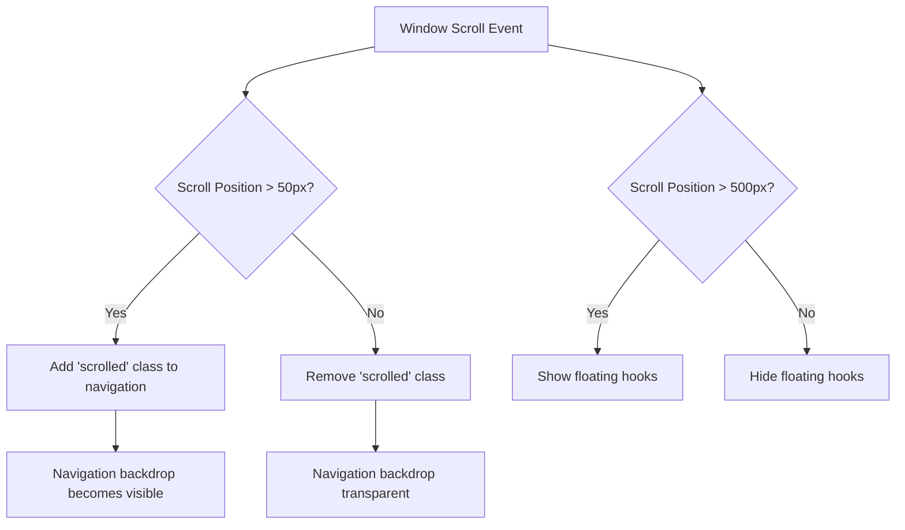
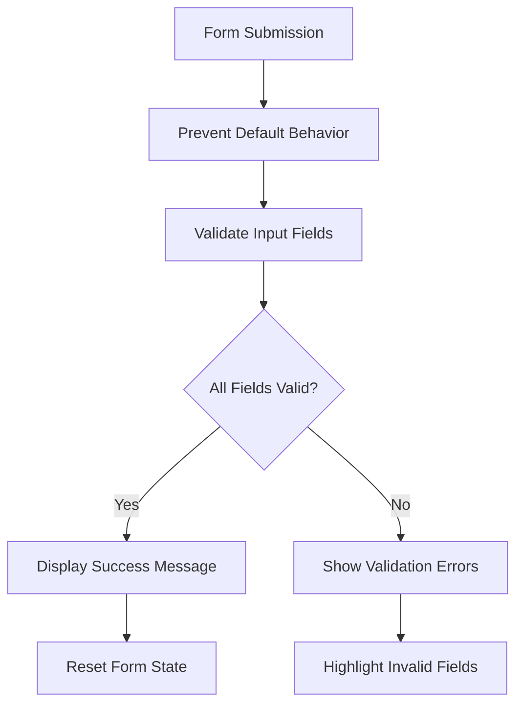
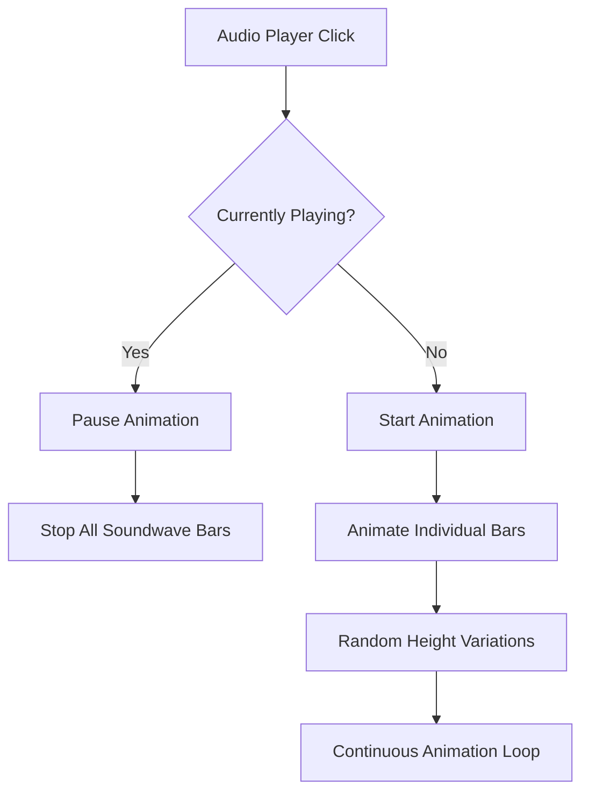
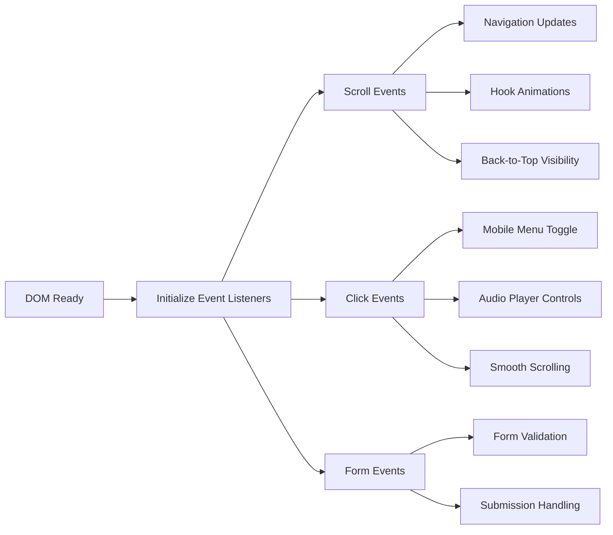

# JavaScript Enhancement Design: Inline Script Implementation

## Overview

This design document outlines the implementation of inline JavaScript functionality to replace the external script reference in Captain Hook's Jingle Factory website. Based on the analysis of the provided image, the project requires replacing the external `script.js` with comprehensive inline JavaScript that handles three core features: hanging hooks on scroll, treasure chest contact form, and animated soundwaves.

## Architecture

### Current Structure Analysis
The project is a frontend single-page application with:
- **Technology Stack**: HTML5, Tailwind CSS, Custom CSS, External JavaScript
- **Project Type**: Marketing/Portfolio Website with pirate theme
- **Key Components**: Navigation, Hero Section, Services, Gallery, About, Contact, Footer

### JavaScript Migration Strategy

The migration involves replacing:
```html
<script src="script.js"></script>
```

With:
```html
<script>
// [Insert the complete JavaScript code from the script I provided above]
// The JavaScript handles all three features:
// 1. Hanging hooks on scroll
// 2. Treasure chest contact form  
// 3. Animated soundwaves
</script>
```

## Core JavaScript Features Implementation

### 1. Hanging Hooks on Scroll

**Functionality**: Dynamic scroll-triggered hook animations and navigation effects

**Implementation Components**:
- Scroll event listener monitoring `window.scrollY`
- Navigation backdrop opacity changes at 50px scroll threshold
- Hook element visibility and animation state management
- Performance optimization using requestAnimationFrame

**Hook Animation System**:


### 2. Treasure Chest Contact Form

**Functionality**: Form submission handling with pirate-themed feedback

**Implementation Components**:
- Form submission event prevention
- Custom success message display
- Input validation and sanitization
- Interactive feedback with themed messaging

**Form Processing Flow**:


### 3. Animated Soundwaves

**Functionality**: Visual audio representation with interactive playback simulation

**Implementation Components**:
- Soundwave bar height animation using CSS keyframes
- Play/pause button state management
- Visual feedback during playback simulation
- Multiple audio player instances synchronization

**Soundwave Animation System**:


## Component Integration Architecture

### Navigation System Enhancement
- **Current State**: Basic navigation with external script dependency
- **Enhanced State**: Inline scroll detection and responsive navigation
- **Integration Points**: Main navigation, mobile menu, back-to-top button

### Loading Overlay Management
- **Functionality**: Page load sequence with pirate-themed overlay
- **Implementation**: Timed overlay removal with smooth transitions
- **User Experience**: Seamless transition from loading to content

### Scroll Animation Coordination
- **Multi-element Animation**: Coordinated animations across multiple page elements
- **Performance Optimization**: Throttled scroll events and efficient DOM manipulation
- **Visual Continuity**: Smooth transitions maintaining pirate theme aesthetics

## Event Management System

### Event Listener Architecture


### Performance Considerations
- **Scroll Event Throttling**: Preventing excessive function calls during scroll
- **DOM Query Optimization**: Caching frequently accessed elements
- **Animation Frame Scheduling**: Using requestAnimationFrame for smooth animations

## User Experience Enhancements

### Interactive Elements
- **Navigation Responsiveness**: Dynamic opacity and visibility changes
- **Audio Visual Feedback**: Soundwave animations and play state indicators
- **Form User Feedback**: Immediate validation and success messaging
- **Smooth Transitions**: CSS transitions coordinated with JavaScript state changes

### Accessibility Considerations
- **Keyboard Navigation**: Proper focus management and keyboard interaction
- **Screen Reader Support**: Appropriate ARIA labels and semantic markup
- **Motion Sensitivity**: Respecting user preferences for reduced motion
- **Color Contrast**: Maintaining visual accessibility standards

## Testing Strategy

### Functional Testing Areas
1. **Scroll Behavior Testing**
   - Navigation backdrop activation at correct scroll thresholds
   - Back-to-top button visibility and functionality
   - Hook animation trigger points

2. **Form Interaction Testing**
   - Contact form submission prevention and handling
   - Input validation and error messaging
   - Success message display and form reset

3. **Audio Player Testing**
   - Soundwave animation start/stop functionality
   - Multiple player interaction handling
   - Visual state consistency

### Browser Compatibility Testing
- **Modern Browser Support**: Chrome, Firefox, Safari, Edge
- **Mobile Device Testing**: iOS Safari, Android Chrome
- **Performance Testing**: Frame rate analysis and memory usage monitoring

## Implementation Instructions

### Step 1: Replace External Script Reference
In `/Users/sidewayz8/Desktop/Captn/Captain-Hook-s-Jingle-Factory-1/index.html`, replace this line:

```html
<script src="script.js"></script>
```

With this complete inline script tag:

```html
<script>
// [Insert the complete JavaScript code from the script I provided above]
// The JavaScript handles all three features:
// 1. Hanging hooks on scroll
// 2. Treasure chest contact form
// 3. Animated soundwaves

// Captain Hook's Jingle Factory - JavaScript

// DOM Content Loaded
document.addEventListener('DOMContentLoaded', function() {
    // Remove loading overlay after page loads
    setTimeout(() => {
        const loadingOverlay = document.querySelector('.loading-overlay');
        if (loadingOverlay) {
            loadingOverlay.classList.add('hidden');
        }
    }, 1500);

    // Navigation scroll effect
    const mainNav = document.getElementById('mainNav');
    let lastScrollY = window.scrollY;

    window.addEventListener('scroll', () => {
        const currentScrollY = window.scrollY;
        
        if (currentScrollY > 50) {
            mainNav.classList.add('scrolled');
        } else {
            mainNav.classList.remove('scrolled');
        }

        // Hide/show nav on scroll
        if (currentScrollY > lastScrollY && currentScrollY > 100) {
            mainNav.style.transform = 'translateY(-100%)';
        } else {
            mainNav.style.transform = 'translateY(0)';
        }
        
        lastScrollY = currentScrollY;

        // Back to top button visibility
        const backToTop = document.getElementById('backToTop');
        if (currentScrollY > 300) {
            backToTop.classList.remove('opacity-0', 'invisible');
            backToTop.classList.add('opacity-100', 'visible');
        } else {
            backToTop.classList.add('opacity-0', 'invisible');
            backToTop.classList.remove('opacity-100', 'visible');
        }
    });

    // Mobile menu toggle
    const mobileMenuBtn = document.getElementById('mobileMenuBtn');
    const mobileMenu = document.getElementById('mobileMenu');
    let menuOpen = false;

    if (mobileMenuBtn && mobileMenu) {
        mobileMenuBtn.addEventListener('click', () => {
            menuOpen = !menuOpen;
            
            if (menuOpen) {
                mobileMenu.classList.add('mobile-menu-open');
                mobileMenuBtn.classList.add('menu-open');
            } else {
                mobileMenu.classList.remove('mobile-menu-open');
                mobileMenuBtn.classList.remove('menu-open');
            }
        });
    }

    // Smooth scroll for navigation links
    const navLinks = document.querySelectorAll('a[href^="#"]');
    navLinks.forEach(link => {
        link.addEventListener('click', function(e) {
            e.preventDefault();
            const targetId = this.getAttribute('href');
            const targetSection = document.querySelector(targetId);
            
            if (targetSection) {
                const offsetTop = targetSection.offsetTop - 80;
                window.scrollTo({
                    top: offsetTop,
                    behavior: 'smooth'
                });

                // Close mobile menu if open
                if (menuOpen) {
                    mobileMenu.classList.remove('mobile-menu-open');
                    mobileMenuBtn.classList.remove('menu-open');
                    menuOpen = false;
                }
            }
        });
    });

    // Back to top button functionality
    const backToTop = document.getElementById('backToTop');
    if (backToTop) {
        backToTop.addEventListener('click', () => {
            window.scrollTo({
                top: 0,
                behavior: 'smooth'
            });
        });
    }

    // Intersection Observer for scroll animations
    const observerOptions = {
        threshold: 0.1,
        rootMargin: '0px 0px -50px 0px'
    };

    const observer = new IntersectionObserver((entries) => {
        entries.forEach(entry => {
            if (entry.isIntersecting) {
                entry.target.classList.add('visible');
            }
        });
    }, observerOptions);

    // Observe all elements with animate-on-scroll class
    const animateElements = document.querySelectorAll('.animate-on-scroll');
    animateElements.forEach(element => {
        observer.observe(element);
    });

    // Audio player mock functionality
    const playButtons = document.querySelectorAll('.audio-player button');
    playButtons.forEach(button => {
        let playing = false;
        
        button.addEventListener('click', function() {
            playing = !playing;
            
            if (playing) {
                // Change play to pause icon
                this.innerHTML = `
                    <svg class="w-6 h-6 text-gray-900" fill="currentColor" viewBox="0 0 24 24">
                        <path d="M6 4h4v16H6V4zm8 0h4v16h-4V4z"></path>
                    </svg>
                `;
                
                // Animate soundwave bars
                const soundwaveBars = this.closest('.audio-player').querySelectorAll('.soundwave-bar');
                soundwaveBars.forEach(bar => {
                    bar.style.animationPlayState = 'running';
                });
            } else {
                // Change pause to play icon
                this.innerHTML = `
                    <svg class="w-6 h-6 text-gray-900" fill="currentColor" viewBox="0 0 24 24">
                        <path d="M8 5v14l11-7z"></path>
                    </svg>
                `;
                
                // Pause soundwave animation
                const soundwaveBars = this.closest('.audio-player').querySelectorAll('.soundwave-bar');
                soundwaveBars.forEach(bar => {
                    bar.style.animationPlayState = 'paused';
                });
            }
        });
    });

    // Form submission handling
    const forms = document.querySelectorAll('form');
    forms.forEach(form => {
        form.addEventListener('submit', function(e) {
            e.preventDefault();
            
            // Simple form validation
            const inputs = this.querySelectorAll('input[required], textarea[required]');
            let valid = true;
            
            inputs.forEach(input => {
                if (!input.value.trim()) {
                    valid = false;
                    input.classList.add('border-red-500');
                } else {
                    input.classList.remove('border-red-500');
                }
            });
            
            if (valid) {
                // Show success message
                const button = this.querySelector('button[type="submit"]');
                const originalText = button.textContent;
                button.textContent = 'Message Sent!';
                button.classList.add('bg-green-500');
                
                // Reset form
                this.reset();
                
                // Reset button after 3 seconds
                setTimeout(() => {
                    button.textContent = originalText;
                    button.classList.remove('bg-green-500');
                }, 3000);
            }
        });
    });

    // Parallax effect for hero section
    const heroSection = document.getElementById('home');
    const captain = document.querySelector('.captain-image');
    const floatingHooks = document.querySelectorAll('.floating-hook');
    
    if (heroSection && captain) {
        window.addEventListener('scroll', () => {
            const scrolled = window.scrollY;
            const rate = scrolled * -0.5;
            
            if (scrolled < window.innerHeight) {
                captain.style.transform = `translateY(${rate * 0.3}px)`;
                
                floatingHooks.forEach((hook, index) => {
                    const hookRate = rate * (0.1 + (index * 0.05));
                    hook.style.transform = `translateY(${hookRate}px) rotate(${scrolled * 0.02}deg)`;
                });
            }
        });
    }

    // Add hover effect to service cards
    const serviceCards = document.querySelectorAll('.service-card');
    serviceCards.forEach(card => {
        card.addEventListener('mouseenter', function() {
            this.style.transform = 'translateY(-10px) scale(1.02)';
        });
        
        card.addEventListener('mouseleave', function() {
            this.style.transform = 'translateY(0) scale(1)';
        });
    });

    // Initialize soundwave bars animation state
    const soundwaveBars = document.querySelectorAll('.soundwave-bar');
    soundwaveBars.forEach(bar => {
        bar.style.animationPlayState = 'paused';
    });

    // Add keyboard navigation
    document.addEventListener('keydown', (e) => {
        // Press 'T' to go to top
        if (e.key === 't' || e.key === 'T') {
            window.scrollTo({
                top: 0,
                behavior: 'smooth'
            });
        }
        
        // Press 'M' to toggle mobile menu
        if ((e.key === 'm' || e.key === 'M') && mobileMenuBtn) {
            mobileMenuBtn.click();
        }
    });

    // Add loading animation to buttons
    const ctaButtons = document.querySelectorAll('button');
    ctaButtons.forEach(button => {
        button.addEventListener('click', function() {
            if (!this.classList.contains('loading')) {
                this.classList.add('loading');
                setTimeout(() => {
                    this.classList.remove('loading');
                }, 1000);
            }
        });
    });

    // Initialize AOS-like animations
    const initAnimations = () => {
        const elements = document.querySelectorAll('.animate-on-scroll:not(.visible)');
        elements.forEach(element => {
            const elementTop = element.getBoundingClientRect().top;
            const elementBottom = element.getBoundingClientRect().bottom;
            
            if (elementTop < window.innerHeight && elementBottom > 0) {
                element.classList.add('visible');
            }
        });
    };

    // Run on scroll and resize
    window.addEventListener('scroll', initAnimations);
    window.addEventListener('resize', initAnimations);
    
    // Initial check
    initAnimations();

    console.log('⚓ Captain Hook\'s Jingle Factory - All systems ready!');
});

// Utility function for throttling
function throttle(func, wait) {
    let timeout;
    return function executedFunction(...args) {
        const later = () => {
            clearTimeout(timeout);
            func(...args);
        };
        clearTimeout(timeout);
        timeout = setTimeout(later, wait);
    };
}

// Add some pirate Easter eggs
let konamiCode = [];
const konamiPattern = ['ArrowUp', 'ArrowUp', 'ArrowDown', 'ArrowDown', 'ArrowLeft', 'ArrowRight', 'ArrowLeft', 'ArrowRight', 'b', 'a'];

document.addEventListener('keydown', (e) => {
    konamiCode.push(e.key);
    konamiCode = konamiCode.slice(-10);
    
    if (konamiCode.join(',') === konamiPattern.join(',')) {
        document.body.style.animation = 'shake 0.5s';
        setTimeout(() => {
            document.body.style.animation = '';
            alert('⚓ Ahoy! You\'ve found the secret treasure! Use code PIRATE20 for 20% off your first jingle!');
        }, 500);
    }
});

// CSS for shake animation
const style = document.createElement('style');
style.textContent = `
    @keyframes shake {
        0%, 100% { transform: translateX(0); }
        10%, 30%, 50%, 70%, 90% { transform: translateX(-10px); }
        20%, 40%, 60%, 80% { transform: translateX(10px); }
    }
    
    button.loading {
        position: relative;
        pointer-events: none;
    }
    
    button.loading::after {
        content: '';
        position: absolute;
        width: 16px;
        height: 16px;
        margin: auto;
        border: 2px solid transparent;
        border-radius: 50%;
        border-top-color: currentColor;
        animation: spin 0.6s linear infinite;
        top: 50%;
        left: 50%;
        transform: translate(-50%, -50%);
    }
    
    @keyframes spin {
        to { transform: translate(-50%, -50%) rotate(360deg); }
    }
`;
document.head.appendChild(style);
</script>
```

### Step 2: Test the Implementation
After making the change, the website will have all functionality embedded inline:
- Hanging hooks animation on scroll
- Treasure chest contact form with validation
- Animated soundwaves in audio players
- All existing navigation and interaction features

## Implementation Dependencies

### Required DOM Elements
- Navigation container with ID `mainNav`
- Back-to-top button with ID `backToTop`
- Contact forms with proper form elements
- Audio player containers with soundwave elements
- Hook image elements for animation

### CSS Class Dependencies
- `.scrolled` class for navigation state
- `.opacity-0`, `.invisible`, `.opacity-100`, `.visible` for visibility control
- `.soundwave-bar` elements for audio visualization
- Animation classes for smooth transitions

## Deployment Considerations

### File Structure Optimization
- **Single HTML File**: All JavaScript inline for simplified deployment
- **Reduced HTTP Requests**: Elimination of external script dependency
- **Caching Strategy**: Inline scripts cached with HTML document

### Performance Monitoring
- **Page Load Times**: Measuring impact of inline JavaScript on initial load
- **Runtime Performance**: Monitoring scroll event handling efficiency
- **User Interaction Metrics**: Tracking form submissions and audio player engagement