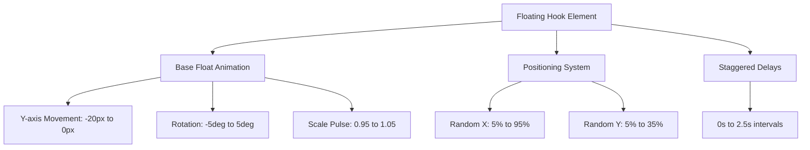
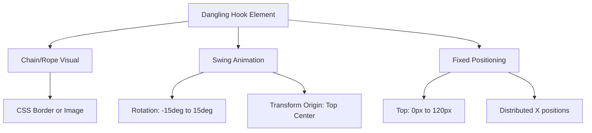

# Floating Hooks Implementation Design

## Overview

This design document outlines the implementation of floating pirate hooks using the actual hook.png image file and adding dangling hooks from the top of the screen. The current CSS-only implementation creates large blocks instead of proper hook visuals, so we need to replace it with image-based floating animations and add top-hanging hooks for enhanced pirate theming.

## Current Issues Analysis

### Problem Identification
- CSS-only hook implementation creates large rectangular blocks
- Missing actual hook image usage from `public/hook.png`
- No dangling hooks from screen top
- Poor visual integration with pirate theme

### Technical Debt
- Oversized CSS hook elements (60px x 80px blocks)
- Complex CSS pseudo-elements creating geometric shapes
- No image optimization or loading considerations

## Architecture

### Component Structure
```
Floating Hooks System
├── Background Floating Hooks (6 instances)
│   ├── Image-based implementation
│   ├── Random positioning system
│   └── Smooth floating animations
├── Top Dangling Hooks (4-6 instances)
│   ├── Fixed top positioning
│   ├── Swaying animations
│   └── Chain/rope visual elements
└── Performance Optimization
    ├── CSS transforms for animations
    ├── Image preloading
    └── Animation performance monitoring
```

### Animation System Design

#### Floating Hooks Animation


#### Dangling Hooks Animation


## Implementation Strategy

### Phase 1: Replace CSS Hooks with Images

#### HTML Structure Modification
```html
<!-- Background Floating Hooks -->
<div class="hooks-container absolute inset-0 pointer-events-none">
    
    
    
    
    
    
</div>
```

#### CSS Implementation
```css
.floating-hook {
    position: absolute;
    width: 40px;
    height: 50px;
    opacity: 0.7;
    filter: drop-shadow(0 4px 15px rgba(255, 215, 0, 0.3));
    animation: floatSmooth 6s ease-in-out infinite;
    z-index: 1;
}

@keyframes floatSmooth {
    0%, 100% { 
        transform: translateY(0) rotate(-2deg) scale(1);
    }
    33% { 
        transform: translateY(-15px) rotate(2deg) scale(1.02);
    }
    66% { 
        transform: translateY(-8px) rotate(-1deg) scale(0.98);
    }
}

/* Individual hook positioning and delays */
.floating-hook-1 { top: 10%; left: 8%; animation-delay: 0s; }
.floating-hook-2 { top: 25%; right: 12%; animation-delay: 1s; }
.floating-hook-3 { top: 15%; left: 35%; animation-delay: 2s; }
.floating-hook-4 { top: 30%; right: 25%; animation-delay: 3s; }
.floating-hook-5 { top: 8%; left: 60%; animation-delay: 4s; }
.floating-hook-6 { top: 22%; right: 8%; animation-delay: 5s; }
```

### Phase 2: Add Top Dangling Hooks

#### HTML Structure for Dangling Hooks
```html
<!-- Top Dangling Hooks -->
<div class="dangling-hooks-container fixed top-0 left-0 right-0 pointer-events-none z-10">
    <div class="dangling-hook dangling-hook-1">
        <div class="hook-chain"></div>
        
    </div>
    <div class="dangling-hook dangling-hook-2">
        <div class="hook-chain"></div>
        
    </div>
    <div class="dangling-hook dangling-hook-3">
        <div class="hook-chain"></div>
        
    </div>
    <div class="dangling-hook dangling-hook-4">
        <div class="hook-chain"></div>
        
    </div>
</div>
```

#### CSS for Dangling Hooks
```css
.dangling-hooks-container {
    height: 150px;
    overflow: hidden;
}

.dangling-hook {
    position: absolute;
    top: -20px;
    transform-origin: top center;
    animation: danglingSwing 4s ease-in-out infinite;
}

.hook-chain {
    width: 2px;
    height: 80px;
    background: linear-gradient(180deg, #8B4513 0%, #A0522D 100%);
    margin: 0 auto 5px;
    box-shadow: inset 0 0 3px rgba(0, 0, 0, 0.3);
}

.hook-image {
    width: 30px;
    height: 38px;
    display: block;
    margin: 0 auto;
    filter: drop-shadow(0 2px 8px rgba(0, 0, 0, 0.4));
}

@keyframes danglingSwing {
    0%, 100% { transform: rotate(-8deg); }
    50% { transform: rotate(8deg); }
}

/* Positioning for dangling hooks */
.dangling-hook-1 { left: 15%; animation-delay: 0s; }
.dangling-hook-2 { left: 35%; animation-delay: 1s; }
.dangling-hook-3 { left: 65%; animation-delay: 2s; }
.dangling-hook-4 { right: 15%; animation-delay: 3s; }
```

### Phase 3: Performance Optimization

#### Image Preloading Strategy
```html
<link rel="preload" href="./public/hook.png" as="image">
```

#### CSS Performance Enhancements
```css
.floating-hook, .hook-image {
    will-change: transform;
    backface-visibility: hidden;
    transform: translateZ(0);
}

.hooks-container, .dangling-hooks-container {
    contain: layout style paint;
}
```

## Responsive Design Considerations

### Mobile Optimization
```css
@media (max-width: 768px) {
    .floating-hook {
        width: 28px;
        height: 35px;
    }
    
    .dangling-hook {
        display: none;
    }
    
    .dangling-hook-1, .dangling-hook-4 {
        display: block;
    }
    
    .hook-chain {
        height: 60px;
    }
    
    .hook-image {
        width: 24px;
        height: 30px;
    }
}

@media (max-width: 480px) {
    .floating-hook-3, .floating-hook-5 {
        display: none;
    }
}
```

### Tablet Adjustments
```css
@media (min-width: 769px) and (max-width: 1024px) {
    .floating-hook {
        width: 35px;
        height: 44px;
    }
    
    .hook-image {
        width: 26px;
        height: 33px;
    }
}
```

## Visual Enhancement Features

### Advanced Animation Effects

#### Floating Hooks Interaction
```css
.floating-hook:hover {
    animation-play-state: paused;
    transform: scale(1.1) rotate(10deg);
    filter: drop-shadow(0 6px 20px rgba(255, 215, 0, 0.5));
    transition: all 0.3s ease;
}
```

#### Chain Animation for Dangling Hooks
```css
.hook-chain::before {
    content: '';
    position: absolute;
    top: 0;
    left: 50%;
    width: 6px;
    height: 6px;
    background: #654321;
    border-radius: 50%;
    transform: translateX(-50%);
    animation: chainLink 2s ease-in-out infinite;
}

@keyframes chainLink {
    0%, 100% { opacity: 0.6; }
    50% { opacity: 1; }
}
```

### Color Variations
```css
.floating-hook-1, .floating-hook-4 {
    filter: drop-shadow(0 4px 15px rgba(255, 215, 0, 0.3)) 
            hue-rotate(0deg);
}

.floating-hook-2, .floating-hook-5 {
    filter: drop-shadow(0 4px 15px rgba(123, 44, 191, 0.3)) 
            hue-rotate(45deg);
}

.floating-hook-3, .floating-hook-6 {
    filter: drop-shadow(0 4px 15px rgba(16, 185, 129, 0.3)) 
            hue-rotate(90deg);
}
```

## Integration Points

### Existing CSS Removal
- Remove current `.hook` class and related pseudo-elements
- Remove `.hook-1` through `.hook-6` positioning classes
- Maintain `.hooks-container` but modify its contents

### Z-Index Management
```css
.dangling-hooks-container { z-index: 5; }
.floating-hook { z-index: 1; }
.nav-backdrop { z-index: 10; }
```

### Performance Monitoring
```javascript
// Animation performance check
const hooks = document.querySelectorAll('.floating-hook, .dangling-hook');
const observer = new IntersectionObserver((entries) => {
    entries.forEach(entry => {
        if (entry.isIntersecting) {
            entry.target.style.animationPlayState = 'running';
        } else {
            entry.target.style.animationPlayState = 'paused';
        }
    });
});

hooks.forEach(hook => observer.observe(hook));
```

## Testing Strategy

### Visual Testing Checklist
- [ ] Hook images load properly across all devices
- [ ] Floating animations are smooth and natural
- [ ] Dangling hooks swing realistically
- [ ] No layout shifts during image loading
- [ ] Proper opacity and shadow effects
- [ ] Responsive behavior on mobile/tablet
- [ ] Performance remains smooth with all animations

### Browser Compatibility
- Chrome 80+
- Firefox 75+
- Safari 13+
- Edge 80+
- Mobile Safari iOS 13+
- Chrome Mobile 80+

### Performance Benchmarks
- Target: 60fps animation performance
- Image loading: < 100ms
- Memory usage: < 5MB additional
- CPU usage: < 10% during animations