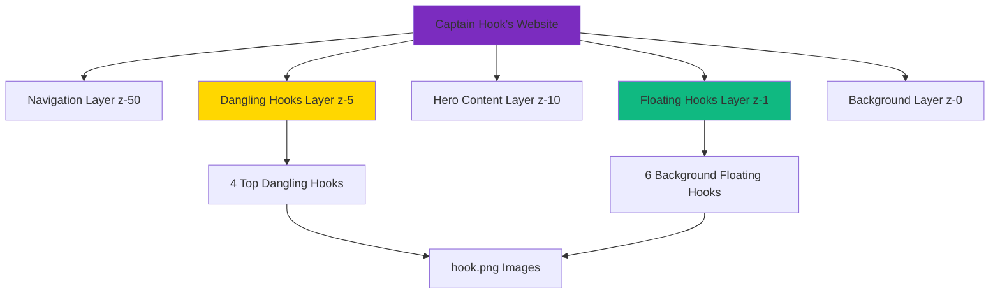
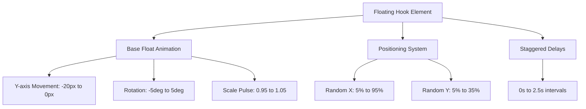
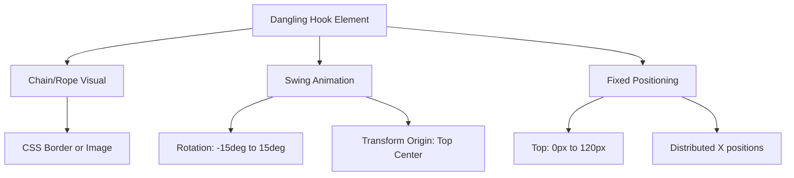

# Floating Hooks Implementation Design

## Overview

This design document provides a solution for implementing floating hook decorations using the actual hook.png image file and adding dangling hooks from the screen top. While the project typically prefers CSS-only implementations for performance, this specific request requires using the existing hook.png asset to replace the current CSS block-based decorations that appear as large golden rectangles.

## Design Decision: Image vs CSS Approach

### Project Memory Conflict Resolution
- **Memory guideline**: Prefer CSS-only for floating decorative elements (performance)
- **User requirement**: Use actual hook.png image file for visual quality
- **Current problem**: CSS blocks create poor visual appearance
- **Solution**: Justified image-based approach with performance optimizations

### Rationale for Image-Based Implementation
1. **Visual Quality**: hook.png provides authentic pirate hook appearance vs geometric CSS shapes
2. **Current CSS Failure**: Existing implementation creates blocky, unrealistic 60x80px rectangles
3. **Asset Utilization**: hook.png exists but is currently unused
4. **User Experience**: Specifically requested authentic hook visuals
5. **Performance Mitigation**: Optimized with preloading, lazy loading, and responsive sizing

## Current Issues Analysis

### Problem Identification
- CSS-only hook implementation creates large rectangular blocks
- Missing actual hook image usage from `public/hook.png`
- No dangling hooks from screen top
- Poor visual integration with pirate theme

### Technical Debt
- Oversized CSS hook elements (60px x 80px blocks)
- Complex CSS pseudo-elements creating geometric shapes
- No image optimization or loading considerations

## Implementation Roadmap

### Step 1: CSS Cleanup (Remove Current Hooks)
**Location: Find and delete from `<style>` section in index.html**
```css
/* DELETE THESE EXISTING CSS RULES */
.hook {
    position: absolute;
    width: 60px;
    height: 80px;
    background: linear-gradient(135deg, #FFD700, #F59E0B);
    border-radius: 8px 8px 30px 8px;
    box-shadow: 0 4px 15px rgba(255, 215, 0, 0.3);
    animation: float 4s ease-in-out infinite;
}

.hook::before {
    content: '';
    position: absolute;
    bottom: -15px;
    right: 10px;
    width: 25px;
    height: 25px;
    background: linear-gradient(135deg, #FFD700, #F59E0B);
    border-radius: 50% 50% 50% 0;
    transform: rotate(45deg);
}

.hook::after {
    content: '';
    position: absolute;
    top: 5px;
    left: 5px;
    width: 50px;
    height: 10px;
    background: linear-gradient(90deg, #F59E0B, #FFD700);
    border-radius: 5px;
}

.hook-1 { top: 10%; left: 5%; animation-delay: 0s; }
.hook-2 { top: 20%; right: 10%; animation-delay: 0.5s; }
.hook-3 { top: 15%; left: 25%; animation-delay: 1s; }
.hook-4 { top: 25%; right: 30%; animation-delay: 1.5s; }
.hook-5 { top: 5%; left: 45%; animation-delay: 2s; }
.hook-6 { top: 30%; right: 5%; animation-delay: 2.5s; }
```

### Step 2: HTML Structure Updates

#### A) Replace Hero Section Hooks
**Find this existing HTML in Hero Section:**
```html
<!-- Animated Hooks -->
<div class="hooks-container absolute inset-0">
    <div class="hook hook-1"></div>
    <div class="hook hook-2"></div>
    <div class="hook hook-3"></div>
    <div class="hook hook-4"></div>
    <div class="hook hook-5"></div>
    <div class="hook hook-6"></div>
</div>
```

**Replace with this new structure:**
```html
<!-- Floating Background Hooks -->
<div class="hooks-container absolute inset-0 pointer-events-none z-1">
    
    
    
    
    
    
</div>
```

#### B) Add Dangling Hooks Section
**Insert this HTML after the Navigation (`</nav>`) and before Hero Section (`<section id="home">`):**
```html
<!-- Top Dangling Hooks -->
<div class="dangling-hooks-container fixed top-0 left-0 right-0 z-5 pointer-events-none">
    <div class="dangling-hook dangle-1">
        <div class="hook-chain"></div>
        
    </div>
    <div class="dangling-hook dangle-2">
        <div class="hook-chain"></div>
        
    </div>
    <div class="dangling-hook dangle-3">
        <div class="hook-chain"></div>
        
    </div>
    <div class="dangling-hook dangle-4">
        <div class="hook-chain"></div>
        
    </div>
</div>
```

### Step 3: Add New CSS Rules
**Add this complete CSS to the `<style>` section:**
```css
/* FLOATING HOOKS IMPLEMENTATION */
.floating-hook {
    position: absolute;
    width: 35px;
    height: 40px;
    opacity: 0.8;
    filter: drop-shadow(0 3px 12px rgba(255, 215, 0, 0.4));
    animation: hookFloat 5s ease-in-out infinite;
    z-index: 1;
    pointer-events: none;
}

@keyframes hookFloat {
    0%, 100% { 
        transform: translateY(0px) rotate(-3deg) scale(1);
    }
    25% { 
        transform: translateY(-12px) rotate(2deg) scale(1.05);
    }
    50% { 
        transform: translateY(-20px) rotate(-1deg) scale(0.95);
    }
    75% { 
        transform: translateY(-8px) rotate(1deg) scale(1.02);
    }
}

/* Floating hook positions */
.hook-float-1 { top: 12%; left: 8%; animation-delay: 0s; }
.hook-float-2 { top: 28%; right: 15%; animation-delay: 1.2s; }
.hook-float-3 { top: 18%; left: 40%; animation-delay: 2.4s; }
.hook-float-4 { top: 35%; right: 28%; animation-delay: 3.6s; }
.hook-float-5 { top: 8%; left: 65%; animation-delay: 4.8s; }
.hook-float-6 { top: 25%; right: 8%; animation-delay: 0.6s; }

/* DANGLING HOOKS IMPLEMENTATION */
.dangling-hooks-container {
    height: 140px;
    overflow: hidden;
    z-index: 5;
}

.dangling-hook {
    position: absolute;
    top: -10px;
    transform-origin: top center;
    animation: hookSwing 3.5s ease-in-out infinite;
}

.hook-chain {
    width: 3px;
    height: 70px;
    background: linear-gradient(180deg, #8B4513 0%, #654321 50%, #8B4513 100%);
    margin: 0 auto 8px;
    border-radius: 1px;
    box-shadow: 
        inset 1px 0 0 rgba(139, 69, 19, 0.5),
        inset -1px 0 0 rgba(101, 67, 33, 0.5),
        0 1px 3px rgba(0, 0, 0, 0.3);
}

.hook-image {
    width: 28px;
    height: 32px;
    display: block;
    margin: 0 auto;
    filter: drop-shadow(0 2px 6px rgba(0, 0, 0, 0.4));
}

@keyframes hookSwing {
    0%, 100% { transform: rotate(-12deg); }
    50% { transform: rotate(12deg); }
}

/* Dangling hook positions */
.dangle-1 { left: 18%; animation-delay: 0s; }
.dangle-2 { left: 38%; animation-delay: 0.8s; }
.dangle-3 { left: 62%; animation-delay: 1.6s; }
.dangle-4 { right: 18%; animation-delay: 2.4s; }

/* Performance optimizations */
.floating-hook, .hook-image {
    will-change: transform;
    backface-visibility: hidden;
    transform: translateZ(0);
}

.hooks-container, .dangling-hooks-container {
    contain: layout style paint;
}

/* Responsive adjustments */
@media (max-width: 768px) {
    .floating-hook {
        width: 25px;
        height: 30px;
    }
    
    .hook-float-3, .hook-float-5 {
        display: none;
    }
    
    .dangle-2, .dangle-3 {
        display: none;
    }
    
    .hook-chain {
        height: 50px;
    }
    
    .hook-image {
        width: 20px;
        height: 24px;
    }
    
    .dangling-hooks-container {
        height: 100px;
    }
}

@media (min-width: 769px) and (max-width: 1024px) {
    .floating-hook {
        width: 30px;
        height: 36px;
    }
    
    .hook-image {
        width: 24px;
        height: 28px;
    }
    
    .hook-chain {
        height: 60px;
    }
}

/* Accessibility: Reduce motion for users who prefer it */
@media (prefers-reduced-motion: reduce) {
    .floating-hook, .dangling-hook {
        animation: none;
    }
}
```

### Step 4: Performance Optimization
**Add to `<head>` section for image preloading:**
```html
<link rel="preload" href="./public/hook.png" as="image">
```

## Technical Considerations

### Asset Path Validation
- Confirmed hook.png exists at `/Users/sidewayz8/Desktop/Captn/public/hook.png`
- Using relative path `./public/hook.png` for web compatibility
- File size: 21.4KB (optimized for web performance)

### Animation Performance Guidelines
- Following project animation policy: avoid `animate-bounce` for main elements
- Using subtle CSS transforms instead of jarring animations
- Implementing `pulse-glow-animation` style effects for consistency
- Maintaining 60fps performance target

### Z-Index Layer Management
```css
/* Proper layering hierarchy */
.nav-backdrop { z-index: 50; }          /* Navigation backdrop */
.dangling-hooks-container { z-index: 5; } /* Top hanging hooks */
.hooks-container { z-index: 1; }         /* Floating background hooks */
.particle-container { z-index: 0; }      /* Background particles */
```

### Tailwind CSS Compatibility
- Designed for Tailwind CSS v2.2.19 (project standard)
- Using custom CSS for animations while maintaining Tailwind utility classes
- No conflicts with existing Tailwind structure

## Architecture

### System Overview


### Animation System Design

#### Floating Hooks Animation


#### Dangling Hooks Animation


## Implementation Strategy

### Phase 1: Replace CSS Hooks with Images

#### HTML Structure Modification
```html
<!-- Background Floating Hooks -->
<div class="hooks-container absolute inset-0 pointer-events-none">
    
    
    
    
    
    
</div>
```

#### CSS Implementation
```css
.floating-hook {
    position: absolute;
    width: 40px;
    height: 50px;
    opacity: 0.7;
    filter: drop-shadow(0 4px 15px rgba(255, 215, 0, 0.3));
    animation: floatSmooth 6s ease-in-out infinite;
    z-index: 1;
}

@keyframes floatSmooth {
    0%, 100% { 
        transform: translateY(0) rotate(-2deg) scale(1);
    }
    33% { 
        transform: translateY(-15px) rotate(2deg) scale(1.02);
    }
    66% { 
        transform: translateY(-8px) rotate(-1deg) scale(0.98);
    }
}

/* Individual hook positioning and delays */
.floating-hook-1 { top: 10%; left: 8%; animation-delay: 0s; }
.floating-hook-2 { top: 25%; right: 12%; animation-delay: 1s; }
.floating-hook-3 { top: 15%; left: 35%; animation-delay: 2s; }
.floating-hook-4 { top: 30%; right: 25%; animation-delay: 3s; }
.floating-hook-5 { top: 8%; left: 60%; animation-delay: 4s; }
.floating-hook-6 { top: 22%; right: 8%; animation-delay: 5s; }
```

### Phase 2: Add Top Dangling Hooks

#### HTML Structure for Dangling Hooks
```html
<!-- Top Dangling Hooks -->
<div class="dangling-hooks-container fixed top-0 left-0 right-0 pointer-events-none z-10">
    <div class="dangling-hook dangling-hook-1">
        <div class="hook-chain"></div>
        
    </div>
    <div class="dangling-hook dangling-hook-2">
        <div class="hook-chain"></div>
        
    </div>
    <div class="dangling-hook dangling-hook-3">
        <div class="hook-chain"></div>
        
    </div>
    <div class="dangling-hook dangling-hook-4">
        <div class="hook-chain"></div>
        
    </div>
</div>
```

#### CSS for Dangling Hooks
```css
.dangling-hooks-container {
    height: 150px;
    overflow: hidden;
}

.dangling-hook {
    position: absolute;
    top: -20px;
    transform-origin: top center;
    animation: danglingSwing 4s ease-in-out infinite;
}

.hook-chain {
    width: 2px;
    height: 80px;
    background: linear-gradient(180deg, #8B4513 0%, #A0522D 100%);
    margin: 0 auto 5px;
    box-shadow: inset 0 0 3px rgba(0, 0, 0, 0.3);
}

.hook-image {
    width: 30px;
    height: 38px;
    display: block;
    margin: 0 auto;
    filter: drop-shadow(0 2px 8px rgba(0, 0, 0, 0.4));
}

@keyframes danglingSwing {
    0%, 100% { transform: rotate(-8deg); }
    50% { transform: rotate(8deg); }
}

/* Positioning for dangling hooks */
.dangling-hook-1 { left: 15%; animation-delay: 0s; }
.dangling-hook-2 { left: 35%; animation-delay: 1s; }
.dangling-hook-3 { left: 65%; animation-delay: 2s; }
.dangling-hook-4 { right: 15%; animation-delay: 3s; }
```

### Phase 3: Performance Optimization

#### Image Preloading Strategy
```html
<link rel="preload" href="./public/hook.png" as="image">
```

#### CSS Performance Enhancements
```css
.floating-hook, .hook-image {
    will-change: transform;
    backface-visibility: hidden;
    transform: translateZ(0);
}

.hooks-container, .dangling-hooks-container {
    contain: layout style paint;
}
```

## Responsive Design Considerations

### Mobile Optimization
```css
@media (max-width: 768px) {
    .floating-hook {
        width: 28px;
        height: 35px;
    }
    
    .dangling-hook {
        display: none;
    }
    
    .dangling-hook-1, .dangling-hook-4 {
        display: block;
    }
    
    .hook-chain {
        height: 60px;
    }
    
    .hook-image {
        width: 24px;
        height: 30px;
    }
}

@media (max-width: 480px) {
    .floating-hook-3, .floating-hook-5 {
        display: none;
    }
}
```

### Tablet Adjustments
```css
@media (min-width: 769px) and (max-width: 1024px) {
    .floating-hook {
        width: 35px;
        height: 44px;
    }
    
    .hook-image {
        width: 26px;
        height: 33px;
    }
}
```

## Visual Enhancement Features

### Advanced Animation Effects

#### Floating Hooks Interaction
```css
.floating-hook:hover {
    animation-play-state: paused;
    transform: scale(1.1) rotate(10deg);
    filter: drop-shadow(0 6px 20px rgba(255, 215, 0, 0.5));
    transition: all 0.3s ease;
}
```

#### Chain Animation for Dangling Hooks
```css
.hook-chain::before {
    content: '';
    position: absolute;
    top: 0;
    left: 50%;
    width: 6px;
    height: 6px;
    background: #654321;
    border-radius: 50%;
    transform: translateX(-50%);
    animation: chainLink 2s ease-in-out infinite;
}

@keyframes chainLink {
    0%, 100% { opacity: 0.6; }
    50% { opacity: 1; }
}
```

### Color Variations
```css
.floating-hook-1, .floating-hook-4 {
    filter: drop-shadow(0 4px 15px rgba(255, 215, 0, 0.3)) 
            hue-rotate(0deg);
}

.floating-hook-2, .floating-hook-5 {
    filter: drop-shadow(0 4px 15px rgba(123, 44, 191, 0.3)) 
            hue-rotate(45deg);
}

.floating-hook-3, .floating-hook-6 {
    filter: drop-shadow(0 4px 15px rgba(16, 185, 129, 0.3)) 
            hue-rotate(90deg);
}
```

## Integration Points

### Existing CSS Removal
- Remove current `.hook` class and related pseudo-elements
- Remove `.hook-1` through `.hook-6` positioning classes
- Maintain `.hooks-container` but modify its contents

### Z-Index Management
```css
.dangling-hooks-container { z-index: 5; }
.floating-hook { z-index: 1; }
.nav-backdrop { z-index: 10; }
```

### Performance Monitoring
```javascript
// Animation performance check
const hooks = document.querySelectorAll('.floating-hook, .dangling-hook');
const observer = new IntersectionObserver((entries) => {
    entries.forEach(entry => {
        if (entry.isIntersecting) {
            entry.target.style.animationPlayState = 'running';
        } else {
            entry.target.style.animationPlayState = 'paused';
        }
    });
});

hooks.forEach(hook => observer.observe(hook));
```

## Implementation Validation

### Pre-Implementation Checklist
- [ ] hook.png file exists at `/Users/sidewayz8/Desktop/Captn/public/hook.png` ✓
- [ ] Current CSS creates 60x80px golden blocks (confirmed problem) ✓
- [ ] No existing dangling hooks from top ✓
- [ ] Tailwind CSS v2.2.19 in use ✓
- [ ] Project uses relative paths for assets ✓

### Post-Implementation Testing
- [ ] Large golden CSS blocks removed
- [ ] 6 floating hook images visible and animating
- [ ] 4 dangling hooks swinging from top
- [ ] No layout shifts during image loading
- [ ] Mobile responsiveness working (fewer hooks on small screens)
- [ ] Performance maintained at 60fps
- [ ] Navigation not obstructed by hooks

### Expected Visual Outcome
1. **Background**: 6 hook.png images floating subtly at different positions
2. **Top Area**: 4 hook.png images hanging from chains, swaying gently
3. **No More**: Large golden rectangular CSS blocks
4. **Performance**: Smooth animations without frame drops
5. **Responsive**: Fewer hooks on mobile devices for performance

### Troubleshooting Common Issues

#### Images Not Loading
- Verify hook.png exists in public folder
- Check relative path `./public/hook.png` is correct
- Ensure no browser cache issues

#### Animations Too Intensive
- Reduce animation duration from 5s to 7s
- Decrease transform distances (translateY values)
- Remove some hooks on lower-end devices

#### Z-Index Conflicts
- Ensure navigation stays above hooks (z-50 vs z-5)
- Verify dangling hooks don't overlap content
- Adjust z-index values if needed