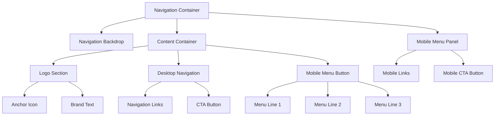
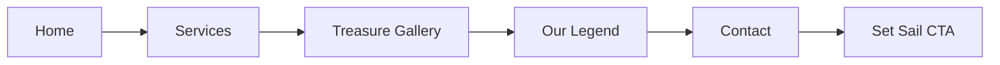

# Navigation Component Design

## Overview

This document outlines the design and implementation strategy for Captain Hook's Jingle Factory navigation component. The navigation system features a fixed-position header with adaptive behavior across devices, incorporating the pirate-themed aesthetic with smooth animations and backdrop effects.

The navigation serves as the primary interface for site navigation, requiring both desktop and mobile implementations while maintaining brand consistency and optimal user experience across all screen sizes.

## Technology Stack & Dependencies

### Core Technologies
- **HTML5**: Semantic navigation structure using `<nav>` element
- **Tailwind CSS v3.4.17**: Utility-first framework for responsive design
- **Custom CSS**: Enhanced animations and pirate-themed styling
- **Vanilla JavaScript**: Interactive functionality and smooth scrolling

### Typography
- **Pirata One**: Logo and brand text
- **Cinzel**: Navigation links and button text
- **Crimson Text**: Supporting text elements

### Design Tokens
```css
:root {
    --purple: #7B2CBF;
    --gold: #FFD700;
    --green: #10B981;
    --dark-purple: #4C1D95;
    --dark-gold: #F59E0B;
}
```

## Component Architecture

### Component Hierarchy



### Component Definition

#### Navigation Container
- **Element**: `<nav id="mainNav">`
- **Positioning**: Fixed at viewport top with z-index 50
- **Behavior**: Transitions backdrop opacity on scroll
- **Classes**: `fixed top-0 left-0 right-0 z-50 transition-all duration-500`

#### Logo Section
- **Structure**: Icon + Brand text container
- **Icon**: Anchor emoji (⚓) with golden gradient background
- **Brand Text**: "Captain Hook's" with gradient text effect
- **Subtitle**: "Jingle Factory" in purple accent color

#### Desktop Navigation
- **Visibility**: Hidden on screens < 1024px (`lg:hidden`)
- **Layout**: Horizontal flex container with space-x-8
- **Links**: Semantic anchor tags with smooth hover transitions
- **CTA**: Gradient button with transform effects

#### Mobile Menu System
- **Button**: Three-line hamburger icon with colored lines
- **Panel**: Slide-down menu with backdrop blur
- **Animation**: Transform and opacity transitions

### Props/State Management

#### Navigation State
```javascript
const navigationState = {
    isScrolled: false,     // Controls backdrop visibility
    isMobileOpen: false,   // Mobile menu toggle state
    activeSection: 'home'  // Current section for active states
};
```

#### Component Props
- `scrollThreshold`: 50px scroll distance for backdrop activation
- `transitionDuration`: 500ms for all animations
- `mobileBreakpoint`: 1024px (lg breakpoint)

### Lifecycle Methods/Hooks

#### Initialization
```javascript
window.addEventListener('DOMContentLoaded', () => {
    initializeNavigation();
    setupScrollListeners();
    setupMobileMenuToggle();
    setupSmoothScrolling();
});
```

#### Scroll Event Handler
```javascript
window.addEventListener('scroll', () => {
    const navbar = document.getElementById('mainNav');
    
    if (window.scrollY > 50) {
        navbar.classList.add('scrolled');
    } else {
        navbar.classList.remove('scrolled');
    }
});
```

### Example Component Usage

```html
<nav id="mainNav" class="fixed top-0 left-0 right-0 z-50 transition-all duration-500 scrolled">
    <div class="nav-backdrop absolute inset-0"></div>
    <div class="relative container mx-auto px-6">
        <div class="flex items-center justify-between py-4">
            <!-- Logo Implementation -->
            <div class="flex items-center space-x-3 group cursor-pointer">
                <div class="relative w-12 h-12">
                    <div class="absolute inset-0 bg-gradient-to-br from-yellow-400 to-yellow-600 rounded-full opacity-20 group-hover:opacity-40 transition-opacity"></div>
                    <div class="relative w-full h-full flex items-center justify-center">
                        <span class="text-2xl">⚓</span>
                    </div>
                </div>
                <div>
                    <h1 class="text-xl font-pirata text-transparent bg-clip-text bg-gradient-to-r from-yellow-400 to-yellow-600">Captain Hook's</h1>
                    <p class="text-xs text-purple-300 font-cinzel uppercase tracking-wider -mt-1">Jingle Factory</p>
                </div>
            </div>

            <!-- Desktop Navigation -->
            <div class="hidden lg:flex items-center space-x-8">
                <a href="#home" class="nav-link py-2 text-gray-300 hover:text-yellow-400 transition-colors duration-300 font-cinzel text-sm uppercase tracking-wide">Home</a>
                <a href="#services" class="nav-link py-2 text-gray-300 hover:text-yellow-400 transition-colors duration-300 font-cinzel text-sm uppercase tracking-wide">Services</a>
                <a href="#gallery" class="nav-link py-2 text-gray-300 hover:text-yellow-400 transition-colors duration-300 font-cinzel text-sm uppercase tracking-wide">Treasure Gallery</a>
                <a href="#about" class="nav-link py-2 text-gray-300 hover:text-yellow-400 transition-colors duration-300 font-cinzel text-sm uppercase tracking-wide">Our Legend</a>
                <a href="#contact" class="nav-link py-2 text-gray-300 hover:text-yellow-400 transition-colors duration-300 font-cinzel text-sm uppercase tracking-wide">Contact</a>
                <button class="px-6 py-2.5 bg-gradient-to-r from-purple-600 to-purple-700 text-white font-cinzel text-sm uppercase tracking-wide rounded-full hover:from-yellow-400 hover:to-yellow-600 transform hover:scale-105 transition-all duration-300">
                    Set Sail
                </button>
            </div>

            <!-- Mobile Menu Button -->
            <button id="mobileMenuBtn" class="lg:hidden relative w-10 h-10 focus:outline-none">
                <span class="menu-line menu-line-1 block absolute h-0.5 w-6 bg-yellow-400 transform transition-all duration-300"></span>
                <span class="menu-line menu-line-2 block absolute h-0.5 w-6 bg-purple-400 transform transition-all duration-300"></span>
                <span class="menu-line menu-line-3 block absolute h-0.5 w-6 bg-green-400 transform transition-all duration-300"></span>
            </button>
        </div>
    </div>

    <!-- Mobile Navigation Menu -->
    <div id="mobileMenu" class="lg:hidden fixed inset-x-0 top-full transform -translate-y-full opacity-0 transition-all duration-500 bg-gray-900/95 backdrop-blur-xl">
        <div class="container mx-auto px-6 py-8">
            <div class="space-y-4">
                <a href="#home" class="block py-3 px-6 text-gray-300 hover:text-yellow-400 hover:bg-purple-900/20 rounded-lg transition-all duration-300 font-cinzel uppercase tracking-wide">Home</a>
                <a href="#services" class="block py-3 px-6 text-gray-300 hover:text-yellow-400 hover:bg-purple-900/20 rounded-lg transition-all duration-300 font-cinzel uppercase tracking-wide">Services</a>
                <a href="#gallery" class="block py-3 px-6 text-gray-300 hover:text-yellow-400 hover:bg-purple-900/20 rounded-lg transition-all duration-300 font-cinzel uppercase tracking-wide">Treasure Gallery</a>
                <a href="#about" class="block py-3 px-6 text-gray-300 hover:text-yellow-400 hover:bg-purple-900/20 rounded-lg transition-all duration-300 font-cinzel uppercase tracking-wide">Our Legend</a>
                <a href="#contact" class="block py-3 px-6 text-gray-300 hover:text-yellow-400 hover:bg-purple-900/20 rounded-lg transition-all duration-300 font-cinzel uppercase tracking-wide">Contact</a>
                <button class="w-full mt-6 px-6 py-3 bg-gradient-to-r from-purple-600 to-purple-700 text-white font-cinzel uppercase tracking-wide rounded-full hover:from-yellow-400 hover:to-yellow-600 transition-all duration-300">
                    Set Sail Now
                </button>
            </div>
        </div>
    </div>
</nav>
```

## Routing & Navigation

### Navigation Links Structure


### Anchor Link Navigation
- **Home**: `#home` → Hero section
- **Services**: `#services` → Services showcase
- **Gallery**: `#gallery` → Audio samples section
- **About**: `#about` → Company story section
- **Contact**: `#contact` → Contact forms section

### Smooth Scrolling Implementation
```javascript
document.querySelectorAll('a[href^="#"]').forEach(anchor => {
    anchor.addEventListener('click', function (e) {
        e.preventDefault();
        const target = document.querySelector(this.getAttribute('href'));
        if (target) {
            target.scrollIntoView({
                behavior: 'smooth',
                block: 'start'
            });
        }
    });
});
```

## Styling Strategy

### Backdrop Effects
```css
.nav-backdrop {
    background: linear-gradient(180deg, 
        rgba(15, 23, 42, 0.98) 0%, 
        rgba(88, 28, 135, 0.95) 50%,
        rgba(15, 23, 42, 0.98) 100%);
    -webkit-backdrop-filter: blur(20px);
    backdrop-filter: blur(20px);
    opacity: 0;
    transition: opacity 0.3s ease;
}

#mainNav.scrolled .nav-backdrop {
    opacity: 1;
}
```

### Hover Effects for Navigation Links
```css
.nav-link {
    position: relative;
    overflow: hidden;
}

.nav-link::after {
    content: '';
    position: absolute;
    bottom: 0;
    left: 0;
    width: 0;
    height: 2px;
    background: linear-gradient(90deg, var(--gold), var(--purple), var(--green));
    transition: width 0.3s ease;
}

.nav-link:hover::after {
    width: 100%;
}
```

### Mobile Menu Animation
```css
.mobile-menu-open {
    transform: translateY(0) !important;
    opacity: 1 !important;
}

.menu-line {
    position: absolute;
    left: 50%;
    transform: translateX(-50%);
}

.menu-line-1 { top: 8px; }
.menu-line-2 { top: 16px; }
.menu-line-3 { top: 24px; }
```

### Hero Section Background Updates

To implement darker purple and green backgrounds as requested:

```css
.hero-gradient-background {
    background: linear-gradient(
        135deg,
        #065F46 0%,     /* Darker green */
        #047857 25%,    /* Dark emerald */
        #581C87 75%,    /* Darker purple */
        #3B0764 100%    /* Very dark purple */
    );
}

.hero-gradient-overlay {
    background: linear-gradient(
        135deg,
        rgba(6, 95, 70, 0.4) 0%,      /* Darker green overlay */
        rgba(4, 120, 87, 0.3) 25%,    /* Dark emerald overlay */
        rgba(88, 28, 135, 0.3) 75%,   /* Darker purple overlay */
        rgba(59, 7, 100, 0.4) 100%    /* Very dark purple overlay */
    );
}
```

## API Integration Layer

### Scroll Position API
```javascript
const navigationAPI = {
    // Get current scroll position
    getScrollPosition: () => window.scrollY,
    
    // Check if navigation should show backdrop
    shouldShowBackdrop: () => window.scrollY > 50,
    
    // Get active section based on scroll position
    getActiveSection: () => {
        const sections = ['home', 'services', 'gallery', 'about', 'contact'];
        // Implementation for detecting current section
    },
    
    // Smooth scroll to section
    scrollToSection: (sectionId) => {
        const target = document.querySelector(`#${sectionId}`);
        if (target) {
            target.scrollIntoView({ behavior: 'smooth', block: 'start' });
        }
    }
};
```

### Mobile Menu State API
```javascript
const mobileMenuAPI = {
    isOpen: false,
    
    toggle: () => {
        mobileMenuAPI.isOpen = !mobileMenuAPI.isOpen;
        const menu = document.getElementById('mobileMenu');
        if (mobileMenuAPI.isOpen) {
            menu.classList.add('mobile-menu-open');
        } else {
            menu.classList.remove('mobile-menu-open');
        }
    },
    
    close: () => {
        mobileMenuAPI.isOpen = false;
        document.getElementById('mobileMenu').classList.remove('mobile-menu-open');
    }
};
```

## Testing Strategy

### Unit Testing
- **Component Rendering**: Verify navigation structure renders correctly
- **Event Handlers**: Test click events for mobile menu toggle
- **Scroll Behavior**: Validate backdrop appearance on scroll
- **Link Navigation**: Ensure anchor links navigate to correct sections

### Integration Testing
- **Responsive Behavior**: Test navigation across different screen sizes
- **Animation Performance**: Verify smooth transitions and transforms
- **Accessibility**: Test keyboard navigation and screen reader compatibility

### Cross-Browser Testing
- **Safari Compatibility**: Ensure `-webkit-backdrop-filter` support
- **Mobile Browsers**: Test touch interactions and mobile menu behavior
- **Performance**: Validate animation smoothness across devices

### Accessibility Testing
```html
<!-- ARIA labels for mobile menu -->
<button id="mobileMenuBtn" 
        aria-label="Open mobile menu" 
        title="Open mobile menu"
        class="lg:hidden relative w-10 h-10 focus:outline-none">
```

### Performance Testing
- **Animation Efficiency**: CSS transforms over position changes
- **Scroll Performance**: Throttled scroll event listeners
- **Mobile Optimization**: Reduced animation complexity on mobile devices

```css
@media (prefers-reduced-motion: reduce) {
    .nav-link,
    .mobile-menu-open,
    .menu-line {
        animation: none;
        transition: none;
    }
}
```